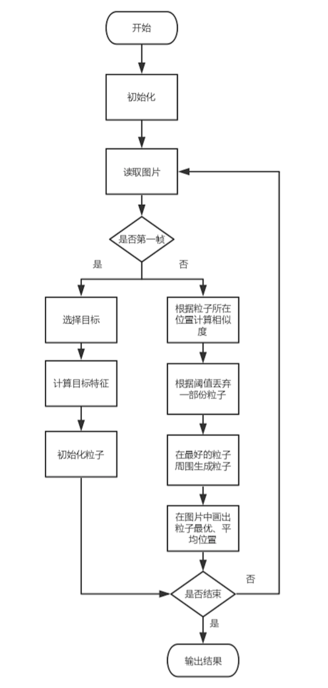

##  particle filter for tracking object
base on the following paper and website:
1. Discriminatively Trained Particle Filters for Complex Multi-Object Tracking[[paper]](http://web.engr.oregonstate.edu/~afern/papers/cvpr09.pdf)
2. [CSDN](https://blog.csdn.net/jinshengtao/article/details/30970733)

- main.py is the entry of this project. some parameters need to changed
- tracker.py is the main class.
- videos storing a sequence of video images
- test.jpg is a demo.
- flow-chart.jpg is the flow chart of this project
### require package
1. python-opencv 3.0+ 
2. numpy

### flow chart

